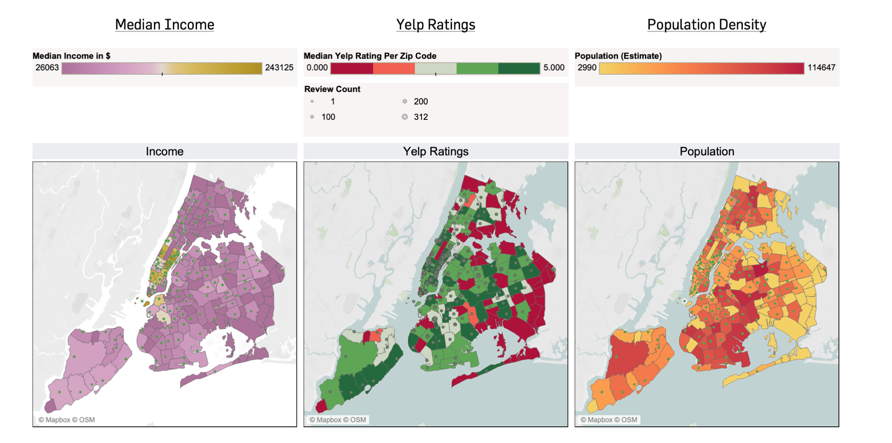

# Yelp Ratings and Healthcare in New York City

Yelp.com is the most-known platform that provides individuals a chance to evaluate every business, ranging from restaurants to DMVs. As someone interested in quality improvement of health care and data science, I started speculating: would there be a connection between Yelp reviews and other social determinants of health? It was a question that came randomly to mind. So I did what millienials do and tweeted it:

<blockquote class="twitter-tweet" data-lang="en">
Hey <a href="https://twitter.com/hashtag/epitwitter?src=hash&amp;ref_src=twsrc%5Etfw">#epitwitter</a> ! has anyone tried pulling yelp ratings and reviews of hospitals and mapped them alongside SES/racial demographics in the United States? Potentially using GIS tools? I&#39;d be very interested to see this!
&mdash; Deeps (@deepssquared) <a href="https://twitter.com/deepssquared/status/1183908738031390721?ref_src=twsrc%5Etfw">October 15, 2019</a></blockquote>

I got quite a few responses, many of them expressing interest. So, instead of going out on a lovely weekend in New York City, I played with R. 

**Disclaimer**: This analysis is preliminary and quite basic to say the least. This was a curiousity project, not anything majorly serious. All my statistics teachers would cry with the number of assumptions about the data I made in doing this. You have been warned.

## Navigation Menu
#### **[Methods](#methods)**
#### **[Data Visualization](#datavis)**
#### **[Statistical Aspect](#stats)**
#### **[Conclusion(s)](#con)**
#### **[Limitations](#limit)**
#### **[Next Steps](#ns)**
#### **[Data Sources](#datasources)**

### Methods 
New York City is fortunate to have a health department that offers publicly available datasets online. Through government websites, I obtained demographic data along with the spatial files. For the Yelp reviews, I used Yelp's API to scrape information concerning 1000 health centers in New York City. All exposures and outcomes were stratified by zip code. I also considered the number of reviews a health center had when making visualizations. All variables listed below were treated as continuous measures. 

| Exposure(s)               | Outcome                         | Other Co-Variates |
|---------------------------|---------------------------------|-------------------|
| Median income by zip code | Median Yelp Rating per zip code | Number of reviews |
| Population of zip code    |                                 |                   |

### Data Visualization 

#### A Closer Look

**Discussion**: I was quite surprised how many zip codes didn't have any health facilities! I queried 1000 health centers, so I was expecting even a small clinic to show up on my query. Some areas were understandable (I don't think New Yorkers would appreciate a hospital in Central Park). The South Bronx though? That was disheartening to see. 

### Statistical Aspect 

#### Spatial Clusters

----------------------------------------------

**Discussion**: Confession, I tried throwing all the variables into a basic linear model and see what would happen. (Yes, I know this is not allowed. Apologies to my regression professor.) None of the predictors were significant, but when accounting for spatial clustering, some zip codes were significantly linked to yelp rating via a predictor.  

### Conclusion(s)? 

Honestly...at the moment...not that many. After looking at this data, I do have a couple of speculations though:

1. Population-density has an inverse relationship with Yelp rating. Clinician to patient ratio impacts wait times and in doing so, the likelihood of a one-star review. 
2. Yelp reviews may be a more promising indicator of quality of care with regards to specific sites of larger hospital systems. A yelp search for Columbia Hospital will result in multiple addresses, simply because Columbia owns so many clinics in Manhattan. Rather than having an aggregate review and ranking (as many lists do for hospitals), it might be more beneficial to segregate outcomes by site or service offered.
3. Income might not be the best indicator in proxying socioeconomic status. A cost of living adjustment might be in order to guage who gets left out of NYC's health clinics.

### Limitations 

There was a response I got on Twitter that sums up the limitations of this basic data project: 

<blockquote class="twitter-tweet" data-lang="en">
Will put money down that reviews correlate positively with % of floor covered with marble and granite.   Independent predictor is the presence of a fountain.  Reviews have little to do with physician quality and more to do with perception of &quot;service&quot;.
&mdash; Andrej Spec, MD, MSCI (@FungalDoc) <a href="https://twitter.com/FungalDoc/status/1184140735144255489?ref_src=twsrc%5Etfw">October 15, 2019</a></blockquote>

As Dr. Spec indicated, Yelp reviews are not measures of healthcare quality; it has always been about customer-satisfaction. Additionally, Yelp is entirely voluntary. As a result, we're likely to get individuals who have amazing experiences or folks who use Yelp as a last resort to voice frustrations. My first Yelp review was a rant against IKEA Delivery for not providing my furniture. Needless to say, while Yelp is a third-party system that is easily accessible and public, it might not contain the data we need.  

Also, I need to emphasize this level of analysis is incredibly **simple** and cannot be used to draw further conclusions. There are multiple criteria I haven't weighed in this model, including assumptions made when mapping spatial clustering, co-linearity, other co-variates (to name a few). At some point, I hope to revisit this analysis with more sophisticated data methods. For now, I thought it would be interesting to pose this question.

### Next Steps 

1. Identify spatial clustering for multiple co-variates and outcomes.
2. Use hierarchical modeling to analyze potential predictors.
3. Qualitative analysis: *probably the most important part*. I've yet to do this: analyze word frequency, identify common phrases, etc. 
4. Classify health centers by specialty: ERs serve a vastly different function than birthing centers. 
5. Stratify visualization by health outcome and clinics that address them accordingly.

#### Data Sources 

- Reviews scraped from [Yelp](https://yelp.com/).
- Spatial files obtained from [New York City Open Data](https://data.cityofnewyork.us/widgets/i8iw-xf4u)
- Demographic information obtained from [US Census](https://factfinder.census.gov/faces/nav/jsf/pages/download_center.xhtml)
