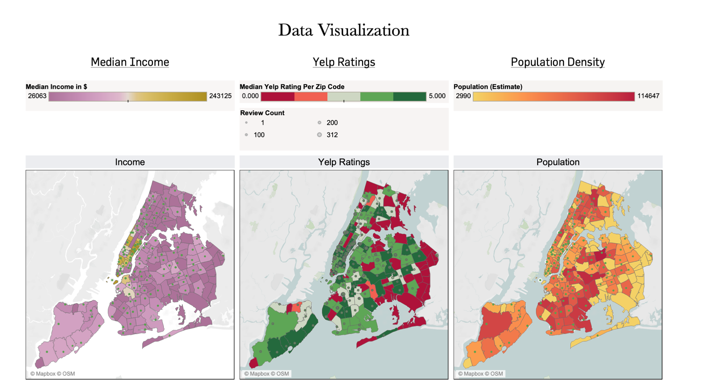
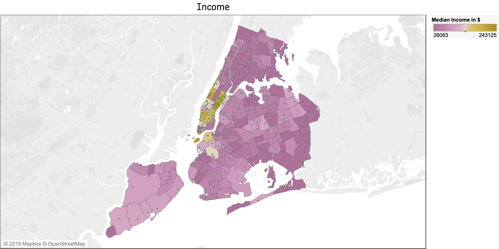
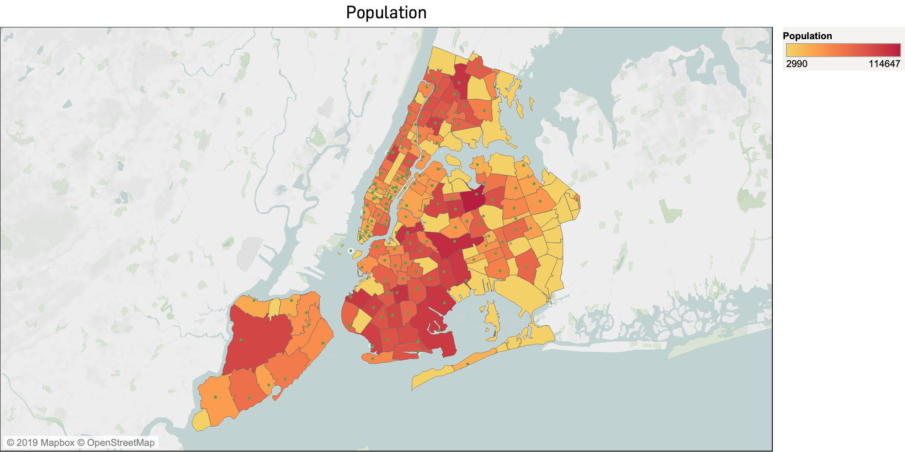

# Yelp Ratings and Healthcare in New York City

Yelp.com is the most-known platform that provides individuals a chance to evaluate every business, ranging from restaurants to DMVs. As someone interested in quality improvement of health care and data science, I started speculating: would there be a connection between Yelp reviews and other social determinants of health? It was a question that came randomly to mind. So I did what millienials do and tweeted it:

<blockquote class="twitter-tweet" data-lang="en">
Hey <a href="https://twitter.com/hashtag/epitwitter?src=hash&amp;ref_src=twsrc%5Etfw">#epitwitter</a> ! has anyone tried pulling yelp ratings and reviews of hospitals and mapped them alongside SES/racial demographics in the United States? Potentially using GIS tools? I&#39;d be very interested to see this!
&mdash; Deeps (@deepssquared) <a href="https://twitter.com/deepssquared/status/1183908738031390721?ref_src=twsrc%5Etfw">October 15, 2019</a></blockquote>

I got quite a few responses, many of them expressing interest. So, instead of going out on a lovely weekend in New York City, I played with R. 

**Disclaimer**: This analysis is preliminary and quite basic to say the least. This was a curiousity project, not anything majorly serious. All my statistics teachers would cry with the number of assumptions about the data I made in doing this. You have been warned.

### Methods
New York City is fortunate to have a health department that offers publicly available datasets online. 
Additionally, I used Yelp's API to scrape information concerning 1000 health centers in New York City.

### Data Visualization

#### A Closer Look

### Statistical Aspect

#### Spatial Clusters

### Limitations

There was a response I got on Twitter that sums up the limitations of this basic data project: 

<blockquote class="twitter-tweet" data-lang="en">
Will put money down that reviews correlate positively with % of floor covered with marble and granite.   Independent predictor is the presence of a fountain.  Reviews have little to do with physician quality and more to do with perception of &quot;service&quot;.
&mdash; Andrej Spec, MD, MSCI (@FungalDoc) <a href="https://twitter.com/FungalDoc/status/1184140735144255489?ref_src=twsrc%5Etfw">October 15, 2019</a></blockquote>

As Dr. Spec indicated, Yelp reviews are not measures of healthcare quality; it has always been about customer-satisfaction. Additionally, Yelp is entirely voluntary. As a result, we're likely to get individuals who have amazing experiences or folks who use Yelp as a last resort to voice frustrations. My first Yelp review was a rant against IKEA Delivery for not providing my furniture. Needless to say, while Yelp is a third-party system that is easily accessible and public, it might not contain the data we need.  

Also, I need to emphasize this level of analysis is incredibly **simple** and cannot be used to draw further conclusions. There are multiple criteria I haven't weighed in this model, including assumptions made when mapping spatial clustering, co-linearity, other co-variates (to name a few). At some point, I hope to revisit this analysis with more sophisticated data methods. For now, I thought it would be interesting to pose this question.

### Next Steps

1. Identify spatial clustering for co-variates and outcomes.
2. Use hierarchical modeling to analyze potential predictors.
3. Qualitative analysis: *probably the most important part*. I've yet to do this: analyze word frequency, identify common phrases, etc. 

#### Data Sources

- Reviews scraped from [Yelp](https://yelp.com/).
- Spatial files obtained from [New York City Open Data](https://data.cityofnewyork.us/widgets/i8iw-xf4u)
- Demographic information obtained from [US Census](https://factfinder.census.gov/faces/nav/jsf/pages/download_center.xhtml)
